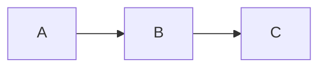

# 小黑的宝藏 - Firefly 博客完全指南

管理「小黑的宝藏」博客项目。遇到任何配置或写作问题，先查此文件再动手。

## 项目基本信息

- **项目路径**: C:\Users\blackboy\Desktop\ljt_4llover
- **GitHub**: https://github.com/4Llover/blog
- **线上域名**: https://www.blackboytreasure.cn
- **部署**: Vercel（git push 自动部署，免费）
- **上游模板**: https://github.com/CuteLeaf/Firefly
- **模板文档**: https://docs-firefly.cuteleaf.cn/
- **技术栈**: Astro 7 + Svelte 5 + Tailwind CSS 4 + @astrojs/vercel
- **编辑器**: Obsidian（Vault = 项目根目录）
- **GitHub 账号**: 4Llover（gh auth 已持久化）

## 素材中转站

用户把素材放到 `resources/` 后通知你，按用途复制：
- 头像 → `public/assets/images/`，同时更新 `profileConfig.ts`
- 壁纸 → `public/assets/images/`，同时更新 `backgroundWallpaper.ts`
- 文章配图 → 对应文章目录或 `public/assets/images/`
- favicon → `public/favicon/`
- 相册照片 → `public/gallery/{相册id}/`

该目录已在 `.gitignore` 中，不会提交到仓库。

---

## 目录结构

```
src/
  config/                        ← 25 个配置模块（改这里自定义网站）
    siteConfig.ts                站点名称/描述/语言/site_url/主题色/页面开关/布局
    profileConfig.ts             头像/签名/社交链接
    navBarConfig.ts              导航栏菜单（预设+自定义+子菜单）
    backgroundWallpaper.ts       壁纸模式/横幅文字/轮播/水波纹/背景视频
    sidebarConfig.ts             侧边栏布局（单/双侧边栏，组件开关）
    commentConfig.ts             评论系统（Twikoo/Waline/Giscus/Disqus/Artalk）
    effectsConfig.ts             樱花特效
    musicConfig.ts               音乐播放器（Meting API/本地音乐）
    fontConfig.ts                字体配置（Google/Fontsource/本地字体）
    coverImageConfig.ts          封面图配置（随机封面图API）
    displaySettingsConfig.ts     设置面板开关（默认关闭，需enable或环境变量）
    announcementConfig.ts        侧边栏公告
    friendsConfig.ts             友链页配置
    galleryConfig.ts             相册配置
    dynamicConfig.ts             动态页配置
    footerConfig.ts              页脚配置（支持HTML注入，内容在FooterConfig.html）
    licenseConfig.ts             文章许可证配置
    sponsorConfig.ts             打赏配置
    pioConfig.ts                 看板娘配置
    expressiveCodeConfig.ts      代码高亮主题和插件配置
    mermaidConfig.ts             Mermaid 图表主题
    plantumlConfig.ts            PlantUML 配置
    booknavConfig.ts             书签导航页配置
    bangumiConfig.ts             番组计划页配置
    analyticsConfig.ts           统计分析（GA/Clarity/Umami/51la）
  content/
    posts/                       ← 博客文章（.md/.mdx）
    dynamic/                     ← 微动态（一条一个文件）
    spec/                        ← 特殊页面（关于页/友链页/留言板/管理面板）
  components/                    ← 页面组件（一般不需要改）
  pages/                         ← 路由
  plugins/                       ← Markdown/HTML 插件
  i18n/                          ← 多语言翻译
public/
  assets/images/                 ← 图片资源
  favicon/                       ← 网站图标（firefly-32.png 等）
  gallery/                       ← 相册照片（按相册ID分目录）
resources/                       ← 用户素材中转站（不提交git）
dist/                            ← 编译产物（不提交git）
```

---

## 命令

```bash
pnpm dev                        # 本地开发 localhost:4321
pnpm build                      # 生产编译（配置变更后必跑）
pnpm preview                    # 预览生产构建
pnpm check                      # Astro 诊断
pnpm type-check                 # TypeScript 类型检查
pnpm format                     # Biome 格式化
pnpm lint                       # Biome lint
pnpm new-post 文件名             # 新建文章（支持中文名，自动转拼音slug）
pnpm new-d 内容文字              # 新建微动态
pnpm new-dynamic 内容文字        # 同上
pnpm lqips                      # 单独生成 LQIP 模糊占位图
```

---

## siteConfig.ts 核心配置

```ts
const SITE_LANG = "zh_CN";   // 支持: zh_CN, zh_TW, en, ja, ru, ko

export const siteConfig = {
  title: "小黑的宝藏",
  subtitle: "美满伴我",
  site_url: "https://www.blackboytreasure.cn",  // ⚠️ 必须与线上域名一致！
  description: "小黑的宝藏 — 美满伴我，记录生活中的点滴美好。",
  keywords: ["小黑的宝藏", "博客", "个人博客", "生活记录"],
  lang: "zh_CN",
  siteStartDate: "2026-08-12",   // 运行天数统计
  timezone: "Asia/Shanghai",
  pageWidth: 100,                 // 页面最大宽度（rem）
  themeColor: {
    hue: 165,                     // 0-360: 红0/青200/蓝绿250/粉345
    defaultMode: "system",        // "light" | "dark" | "system"
  },
  card: {
    border: true,                 // 卡片边框和阴影
    followTheme: false,           // 卡片风格跟随主题色
  },
  pages: {                        // 功能页面开关
    dynamic: true,   // 微动态
    friends: true,   // 友链
    gallery: true,   // 相册
    bangumi: false,  // 番组计划
    guestbook: false,// 留言板
    sponsor: false,  // 打赏
    booknav: false,  // 书签导航
    anime: false,    // 追番
  },
  navbar: {
    logo: { type: "icon", value: "material-symbols:local-fire-department" },
    title: "小黑的宝藏",
    widthFull: false,
    menuAlign: "left",            // "left" | "center"
    followTheme: false,
    stickyNavbar: true,
  },
  categoryBar: true,              // 分类导航栏
  categoryStyle: "rectangle",     // "pill" | "rectangle"
  tagStyle: "pill",               // "pill" | "rectangle"
  foldArticle: true,              // 归档页折叠非最新年份
  pagination: { postsPerPage: 10 },
  postListLayout: {
    defaultMode: "list",          // "list" | "grid"
    mobileDefaultMode: "list",
    coverPosition: "right",       // "right" | "left"
    descriptionLines: 2,          // 0=不截断
    showStatsIcons: true,
    tagsPosition: "meta",         // "meta" | "bottom"
    grid: { masonry: false, columnWidth: 300, coverFullWidth: true },
    meta: { showPublished: true, showCategory: true, showTags: true, tagCount: 3,
            showWords: false, showReadingTime: true },
  },
  post: {
    rehypeCallouts: { theme: "obsidian" },  // "github"|"obsidian"|"vitepress"|"docusaurus"
    showLastModified: true,
    sharePoster: false,
    generateOgImages: false,      // 构建耗时长，按需开启
  },
  imageOptimization: {
    formats: "avif",              // "avif"|"webp"|"both"
    quality: 80,                  // 1-100
    noReferrerDomains: ["*.hdslb.com", "*.bilibili.com"],
  },
  bangumi: { userId: "", mode: "static" },
};
```

**site_url 与域名不一致 = 全站链接/og:url/sitemap 全部失效，这是最常见的部署事故。**

---

## 壁纸配置 (`backgroundWallpaper.ts`)

```ts
export const wallpaperConfig = {
  mode: "banner",  // "banner" 横幅 | "fullscreen" 全屏 | "overlay" 全屏透明 | "none" 纯色
  src: {
    desktop: "assets/images/background.png",  // 也支持数组随机，或随机图API URL
    mobile: "assets/images/background.png",
    // playerUrl: "视频地址",  // 背景视频
  },
  common: {
    dimOpacity: 0.2,              // 壁纸遮罩暗度 0-1
    homeText: {
      enable: true,
      title: "小黑的宝藏",
      titleSize: "3rem",
      subtitle: ["美满伴我", "记录生活中的点滴美好"],
      typewriter: { enable: true, speed: 100, deleteSpeed: 50, pauseTime: 2000 },
    },
    waves: { enable: { desktop: true, mobile: false } },     // 底部水波纹
    gradient: { enable: { desktop: true, mobile: true } },   // 渐变过渡
    carousel: { enable: false, interval: 5000, transitionEffect: "fade" },
    navbar: { transparentMode: "semi", blur: 5 },
  },
  banner: { position: "center" },
  overlay: { zIndex: 1, opacity: 0.5, blur: 10, cardOpacity: 0.5 },
};
```

---

## 个人资料 (`profileConfig.ts`)

```ts
export const profileConfig = {
  avatar: "assets/images/avatar.avif",  // 推荐src目录自动优化
  name: "小黑",
  bio: "美满伴我",
  links: [
    { name: "GitHub", icon: "fa7-brands:github", url: "https://github.com/4Llover", showName: false },
    { name: "Email", icon: "fa7-solid:envelope", url: "mailto:...", showName: false },
    { name: "RSS", icon: "fa7-solid:rss", url: "/rss/", showName: false },
  ],
};
```

头像路径格式：
- src 目录（推荐，自动优化）：`"assets/images/avatar.avif"`
- public 目录（不优化）：`"/assets/images/avatar.webp"`
- 远程 URL：`"https://example.com/avatar.jpg"`

---

## 导航栏 (`navBarConfig.ts`)

预设链接（直接用，带 pageKey 的受 siteConfig.pages 开关控制）：
```
LinkPresets.Home / Archive / Categories / Tags / Friends / About /
Gallery / Bangumi / Guestbook / Sponsor / Dynamic / Booknav / Anime / VNDB
```

自定义链接支持子菜单：
```ts
{ name: "链接", url: "/links/", icon: "material-symbols:link",
  children: [
    { name: "GitHub", url: "https://github.com/...", external: true, icon: "fa7-brands:github" }
  ]
}
```

---

## 侧边栏 (`sidebarConfig.ts`)

```ts
export const sidebarLayoutConfig = {
  enable: true,
  position: "right",                    // "left"|"right"|"both"
  tabletSidebar: "right",               // 平板端显示哪侧
  hideSidebarOnPostPage: false,
  leftComponents: [ ... ],              // 左侧组件列表
  rightComponents: [ ... ],             // 右侧组件列表
};
```

可用组件 type：`profile` / `announcement` / `music` / `categories` / `tags` / `dynamic` / `stats` / `siteInfo` / `calendar` / `sidebarToc` / `advertisement`

组件通用属性：`enable` / `showTitle` / `position("top"|"sticky")` / `showOnPostPage` / `hideOnNonPostPage`

---

## 评论系统 (`commentConfig.ts`)

`type` 设为 `"none"` 关闭。支持 5 种：

| type 值 | 需要配置 |
|---------|---------|
| `"twikoo"` | `envId`（Vercel环境ID或后端地址）|
| `"waline"` | `serverURL`（后端地址）|
| `"giscus"` | `repo` / `repoId` / `category` / `categoryId` |
| `"disqus"` | `shortname` |
| `"artalk"` | `server`（后端地址）|

推荐 Twikoo（免费简洁）：
```ts
type: "twikoo",
twikoo: {
  envId: "https://your-twikoo.vercel.app",
  visitorCount: true,
  jsUrl: "https://cdn.jsdelivr.net/npm/twikoo@1.7.9/dist/twikoo.min.js",
},
```

---

## 其他配置速查

| 文件 | 关键配置项 |
|------|-----------|
| `effectsConfig.ts` | `enable`: true 启用樱花；可调 `sakuraNum`/`size`/`opacity`/`speed` |
| `musicConfig.ts` | `mode: "meting"`（在线，需server/type/id）或 `"local"`（本地文件列表）；`showInNavbar`/`showInSidebar` |
| `fontConfig.ts` | `enable: false` 关闭自定义字体（加载更快）；支持 Google/Fontsource/本地字体；可分别为横幅标题/导航栏/代码块设字体 |
| `coverImageConfig.ts` | `randomCoverImage.enable: true` 启用随机封面；文章frontmatter设 `image: "api"` 使用 |
| `displaySettingsConfig.ts` | **默认关闭**！`enable: true` 或环境变量 `PUBLIC_DISPLAY_SETTINGS=true` 开启 |
| `announcementConfig.ts` | `type: "info"|"warning"|"success"|"error"`；支持链接跳转 |
| `footerConfig.ts` | `enable: true` 开启；内容在 `FooterConfig.html`（支持HTML） |
| `licenseConfig.ts` | `enable: true`；`name`/`url`/`icon` |
| `sponsorConfig.ts` | `methods[]` 打赏方式；`sponsors[]` 赞助列表；`showButtonInPost` 文章内显示 |
| `expressiveCodeConfig.ts` | `darkTheme`/`lightTheme`；插件：语言徽章/Logo/折叠/行号 |
| `mermaidConfig.ts` | `lightTheme`/`darkTheme` |
| `plantumlConfig.ts` | `enable`/`server`/`lightTheme`/`darkTheme` |
| `pioConfig.ts` | 看板娘：Spine/Live2D 模型，`enable`/`model`/`position`/`size`/`interactive` |
| `galleryConfig.ts` | `albums[]`（id/name/desc/location/date/tags/password）；`columnWidth`；照片放 `public/gallery/{id}/` |
| `booknavConfig.ts` | 分组书签数组 |
| `analyticsConfig.ts` | GA/Clarity/Umami/51la |

---

## 文章写作完整规范

### 文件位置
`src/content/posts/你的文章名.md` 或 `src/content/posts/子目录/index.md`

### 完整 Frontmatter

```yaml
---
title: "文章标题"                    # 必填
published: 2026-08-13               # 必填，日期或日期+时间
updated: 2026-08-14                 # 可选，更新日期
description: "一句话摘要"            # 推荐，显示在首页卡片
image: ./cover.jpg                  # 封面图（见下方路径规则）
tags: [标签1, 标签2]                # 标签数组
category: 分类名                     # 分类
draft: false                        # true=草稿不发布
pinned: false                       # true=置顶
slug: custom-url                    # 可选，自定义URL路径
lang: zh-CN                         # 可选，仅当与站点语言不同时
author: 小黑                        # 可选，覆盖默认作者
comment: true                       # 是否允许评论（默认true）
password: "密码"                    # 可选，AES-256-GCM文章加密
passwordHint: "提示"                # 可选，密码提示
licenseName: "CC BY-NC-SA 4.0"     # 可选，覆盖全局许可证
licenseUrl: "https://..."           # 可选
sourceLink: "来源URL"               # 可选
---
```

封面图 image 路径规则：
- `./cover.jpg`：相对markdown文件
- `/assets/images/cover.jpg`：public目录（不优化）
- 远程URL：`https://...`
- `"api"`：使用随机封面图API

### 文章正文支持的语法

**基础Markdown**：标题/列表/引用/代码块/表格/链接/图片

**提示框**（主题可在siteConfig.rehypeCallouts.theme切换）：
```markdown
> [!note] 笔记标题
> 内容
> [!tip] 提示    > [!warning] 警告
> [!important] 重要    > [!caution] 注意
```

**数学公式**（KaTeX）：`$行内$` / `$$块级$$`

**Mermaid图表**：
````markdown

````

**PlantUML图表**：````plantuml` 代码块

**GitHub仓库卡片**：`::github{repo="4Llover/blog"}`

**Wiki Link**（Obsidian风格）：`[[文章slug]]` 或 `[[slug|自定义标题]]`，渲染为文章链接卡片

**图片网格**：
```markdown
::image-grid


::
```

**文章加密**：frontmatter加 `password: "密码"`，构建时AES-256-GCM加密，浏览器本地解密。加密范围：正文+打赏+许可证；标题/封面/评论不加密。

---

## 微动态写作规范

文件位置：`src/content/dynamic/任意文件名.md`（一个文件一条动态）

```yaml
---
published: 2026-08-13 16:30:00
location: 北京           # 可选
pinned: true             # 可选，置顶
---

今天天气真不错，出去吃了一顿火锅。

       # 图片自动整理到底部，支持网格和灯箱
```

快速创建：`pnpm new-d "内容文字"`（自动按当前时间命名，使用siteConfig.timezone时区）

---

## 特殊页面

### 关于页 `src/content/spec/about.md`
- 纯Markdown，无特殊frontmatter，直接写正文
- 路由：`/about/`

### 友链页
- 底部自定义内容：`src/content/spec/friends.mdx`
- 友链数据：`friendsConfig.ts` 中的 `friendsConfig[]`
- 需要：`siteConfig.pages.friends: true`
- 每条友链：`{ title, imgurl, desc, siteurl, tags[], weight, enabled }`

### 留言板 `src/content/spec/guestbook.md`
- 需要：`siteConfig.pages.guestbook: true`
- 评论区通过 `commentConfig.ts` 配置

### 相册
- 配置：`galleryConfig.ts` 的 `albums[]`
- 照片：`public/gallery/{相册id}/`（构建时自动扫描，无需逐张配置）

### 文章管理面板 `src/content/spec/文章管理面板.md`
- Obsidian Dataview 专用，非网站公开页面

---

## Obsidian 集成

- Vault路径 = 项目根目录
- 模板位置：`.obsidian/templates/`
- 新建文章：Ctrl+P → Templater → "新建博客文章"（自动填充frontmatter）
- 快速草稿：Ctrl+P → Templater → "快速草稿"（自动draft:true）
- 图片附件目录：`public/assets/images/obsidian-attachments/`
- 已安装插件：Dataview/Templater/Linter/Outliner/Admonition/Projects 等11个

---

## 发布流程

```bash
# 配置变更时先本地验证（防Vercel构建失败）
pnpm build

git add -A
git commit -m "feat/fix/chore: 描述"
git push origin main
```

Git提交规范：`feat:` 新功能/文章 / `fix:` 修复 / `chore:` 配置/维护 / `docs:` 文档 / `style:` 样式

推送后在Vercel Dashboard确认部署状态为Ready。构建失败时线上保持旧版本不中断。

---

## 部署架构

- **平台**：Vercel（静态站点托管，免费）
- **适配器**：`@astrojs/vercel`（astro.config.mjs）
- **域名**：`www.blackboytreasure.cn`（根域名跳转到www）
- **site_url**：必须与线上域名一致（siteConfig.ts）
- **腾讯云DNS**：A记录→`76.76.21.21`，CNAME www→`cname.vercel-dns.com`

---

## 部署隐患防护

| 隐患 | 后果 | 防护 |
|------|------|------|
| site_url与域名不一致 | 全站链接/SEO失效 | 改域名时同步更新siteConfig.ts |
| push前未pnpm build | Vercel构建失败 | 配置变更后必跑pnpm build |
| @astrojs/vercel升级后路径变化 | 构建失败 | 升级后立即本地build测试 |
| Vercel部署失败无感知 | 线上旧版本 | push后检查Dashboard状态 |
| 大图片未压缩 | 构建慢、带宽耗尽 | 图片控制合理尺寸 |
| trailingSlash:"always" | URL不带/会404 | 所有链接保持末尾/ |
